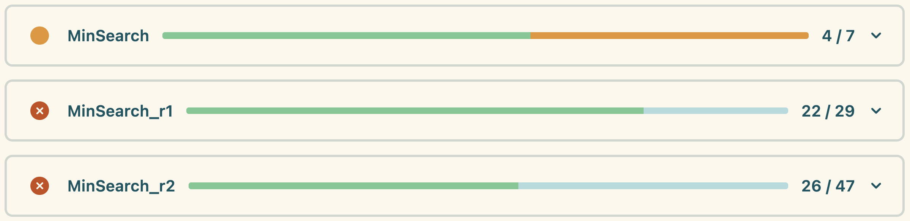
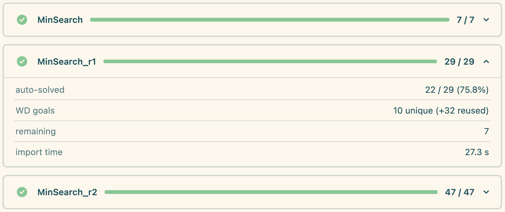

# BARReL: **B** **A**utomated t**R**anslation for **Re**asoning in **L**ean 

BARReL bridges Atelier B proof obligations to Lean. It parses `.pog` files (the [PO XML format](https://www.atelierb.eu/wp-content/uploads/2023/10/pog-1.0.html) produced by Atelier B), converts the obligations into Lean terms, and lets you discharge them with Lean tactics.

## Prerequisites
- Lean 4 (see [`lean-toolchain`](lean-toolchain) for version).
- Mathlib (pulled automatically by Lake).
- For `import machine`: an Atelier B installation with `bin/bxml` and `bin/pog` available. 
  Point BARReL to it with `set_option barrel.atelierb "<path-to-atelierb-root>"` (the directory that contains `bin/` and `include/`).

## Quick start
### Setting up the environment
```bash
lake update     # fetch mathlib and dependencies
lake build      # build all libraries
```

To experiment with the sample machines, open `Test.lean` in your editor or run:
```bash
lake lean Test.lean
```
Note that you may have to edit the path to the Atelier B distribution in `Test.lean` at the beginning of the file.

### Quick example
Consider the B machine [`CounterMin.mch`](specs/CounterMin.mch):
```
MACHINE CounterMin
VARIABLES X
INVARIANT
  X ∈ FIN1(ℤ) ∧ max(X) = -min(X)
INITIALISATION
  X := {0}
OPERATIONS
  inc =
  ANY z WHERE z ∈ ℕ THEN
    X := (-z)..z
  END
END
```
This machine generates 4 proof obligations from the invariant and operation `inc`, and 8 subgoals arising from well-formedness conditions (types, definitions, etc.), for a total of 12 proof obligations:
- _Initialisation_:
  - `{0} ∈ FIN₁(INTEGER)`
  - `max({0}) = -min({0})`
- _Invariant preservation_ for `inc`:
  - `∀ z ∈ ℤ, ∀ X ∈ FIN₁(ℤ), max(X) = -min(X) → z ∈ ℕ → (-z)..z ∈ FIN₁(ℤ)`
  - `∀ z ∈ ℤ, ∀ X ∈ FIN₁(ℤ), max(X) = -min(X) → z ∈ ℕ → max((-z)..z) = -min((-z)..z)`
- _Well-formedness conditions_.

In Lean, `import machine` runs the auto-discharger (`barrel_solve`) over all 12 obligations. It closes 10 of them on its own — the eight well-formedness conditions and the two `∈ FIN₁` typing goals — leaving only the two equalities to prove by hand:

```lean
import Barrel

set_option barrel.atelierb "/<path-to-atelierb-root>/atelierb-free-arm64-24.04.2.app/Contents/Resources"

open B.Builtins

import machine CounterMin from "specs/"

prove_obligations_of CounterMin
next
  intros _ _
  rw [max.of_singleton, min.of_singleton]
  rfl
next
  rintro X z - - hz
  rw [interval.min_eq (neg_le_self hz),
      interval.max_eq (neg_le_self hz),
      Int.neg_neg]
```

Each remaining obligation is presented as one `next` block; the live progress card in the infoview (see below) shows how many were solved automatically and how many are left.

> [!NOTE]
> By default, option `barrel.show_goal_names` is set to `true`, which will display the name of each proof obligation at each `next`, but it can be disabled with:
> ```lean
> set_option barrel.show_goal_names false
> ```

## Live progress in the editor
Industrial POGs can take minutes to import, so each `import` reports into a self-updating **progress card** in the infoview, grouped under a foldable **BARReL state** pane (one card per machine)

<p align="center">
  
  <br/><em>While importing: a spinner and a blue bar that fills as Atelier B's obligations stream in; green bar indicates auto-solved goals.</em>
</p>

<p align="center">
  
  <br/><em>While discharging: yellow (contains <code>sorry</code>), red badge (missing goals).</em>
</p>

<p align="center">
  
  <br/><em>After discharging: green (all proved), with one card unfolded.</em>
</p>

Click a card to expand its summary table: auto-solved count and percentage, unique vs. reused well-formedness (WD) goals, and how many obligations remain.

The panel is on by default; three options control the reporting:

- `barrel.progress` (default `true`) — the live card. Set to `false` to suppress the panel and its reporting entirely.
- `barrel.summary` (default `false`) — also log the summary table as a text message after each import, for batch builds and CI logs.
- `barrel.show_auto_solved` (default `false`) — print the `🎉 Automatically solved N out of M subgoals!` message.

## Using the discharger
Two commands are provided to discharge proof obligations from B machines:

- `import (machine|refinement|implementation|system|pog) <name> from "<directory>"` — call Atelier B (`bxml` then `pog`) to generate the POG on the fly, then consume it. Use `import pog <name>` to read a cached `.pog` directly and skip Atelier B.
- `prove_obligations_of <name>` — discharge all proof obligations generated.

`prove_obligations_of` expands to a sequence of proof goals. Provide one `next` block per goal with the tactic script you want to use:

```lean
set_option barrel.atelierb "/<path-to-atelierb-root>/atelierb-free-arm64-24.04.2.app/Contents/Resources"

open B.Builtins

-- Work directly from a machine
import machine Counter from "specs/"
prove_obligations_of Counter
next
  ...
```

Each `next` corresponds to one simple goal inside the POG. If fewer `next` blocks are provided than goals, the command fails and reports how many remain. Theorems are added under the current namespace using the POG tag and an index (see [`Discharger.lean`](Barrel/Discharger.lean) for naming details).

The discharger also produces Lean theorems named after the POG tags–e.g. `Counter.Initialisation_<i>`, which can be used as lemmas in subsequent proofs, if needed.

## How it works (high level)
1. **Parse PO XML**: read types, definitions, and proof obligations from Atelier B’s PO XML schema.
2. **Extract logical goals**: turn the schema into `Goal` records containing variables, hypotheses, and the goal term.
3. **Encode to Lean**: map B terms and types to Lean expressions, using the set-theoretic primitives in `Barrel/Builtins.lean` and Lean's meta-programming features.
4. **Discharge**: generate Lean theorem declarations for each goal and run the user-supplied tactics. Generated goals should closely resemble the original B proof obligations.

## Sample models
The `specs/` folder contains small machines used during development:
- `Counter.mch`, `Nat.mch`, `Forall.mch`, `Exists.mch`, `Injective.mch`, `HO.mch`, `Enum.mch`, `Lambda.mch`, and their corresponding `.pog` files.
You can copy these as templates when adding new B models.


## Contributing
Contributions and bug reports are very welcome!
