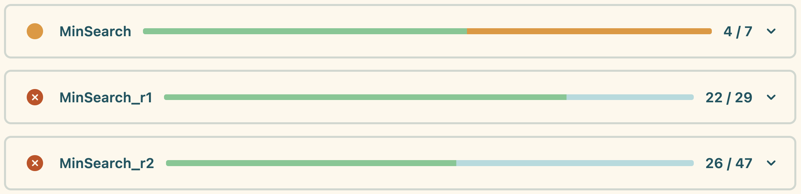

# BARReL: **B** **A**utomated t**R**anslation for **Re**asoning in **L**ean 

BARReL imports Atelier B proof obligations into Lean, where you can prove them with Lean tactics and Mathlib. Partial B operators carry explicit well-definedness (WD) proofs.

## Setup

You need Lean 4 (the version in [`lean-toolchain`](lean-toolchain)) and an Atelier B installation to generate obligations from B sources. Lake fetches Mathlib and the other Lean dependencies:

```bash
lake update
lake build
```

Set `barrel.atelierb` to the Atelier B directory containing `bin/` and `include/`. If you already have a `.pog` file, you can use `import pog` without Atelier B.

## Quick start

The obligations of [`CounterMin.mch`](specs/CounterMin.mch) are proved automatically:

```lean
import Barrel

set_option barrel.atelierb "<path-to-atelierb-root>"

import machine CounterMin from "specs/"
qed CounterMin
```

Open [`examples/CounterMin.lean`](examples/CounterMin.lean) in your Lean editor, or run `lake lean examples/CounterMin.lean` after adjusting its Atelier B path.

For other developments, prove the remaining obligations with separate commands:

| Command | Purpose |
| --- | --- |
| `import machine M from "specs/"` | Generate, translate and try to prove the obligations. |
| `next obligation of M by ...` | Prove the next pending obligation. |
| `obligation Initialisation_1 of M by ...` | Select an obligation by its name within the component. |
| `qed M` | Publish the theorems once all obligations have proofs. |

Imports also support `system`, `refinement`, `implementation` and `pog`. Omit `of M` to use the most recent import. Use `from proof` instead of `by ...` to supply a proof term.

After `qed`, theorems such as `M.Initialisation_1` are available to ordinary Lean proofs and later imports. As in Lean, an explicit `sorry` remains an admission; `qed` does not check for its absence.

## Proof reuse

BARReL shares repeated WD conditions within an import. After `qed`, later imports can also reuse its proved WD theorems, including across Lean modules.

For each WD proof without `sorry` dependencies, BARReL derives a theorem named `<WD theorem>.minimal` and tags it `[barrel_wd]` for reuse. It removes unnecessary premises where possible; the name does not promise a weakest statement. Reuse is an application of an ordinary, kernel-checked Lean theorem.

You can tag or untag a WD theorem yourself, or disable automatic tagging and cross-import reuse:

```lean
attribute [barrel_wd] myLemma
attribute [-barrel_wd] myLemma
set_option barrel.reuse_wd false
```

For other goals, `subsume` tries to apply hypotheses and lemmas tagged `[subsume]`. Use `subsume [myLemma]` to supply a candidate explicitly.

WD matching during import has a bounded search, configured per import:

```lean
import (subsumeMaxHeartbeats := 400) machine M from "specs/"
```

The default is `400`; `0` keeps only exact-repeat sharing. The separate option `barrel.subsume.maxHeartbeats` controls the `subsume` tactic (default `2000`).

## Progress

The Lean infoview shows automatically proved, pending and admitted obligations. Click an obligation to jump to its proof, or use **proof skeleton** to insert commands for the remaining goals.

<p align="center">
  
</p>

Use `set_option barrel.progress false` to hide the panel, or `set_option barrel.summary true` to print import summaries. Use `set_option barrel.show_goal_names false` to hide the names printed at obligation commands.

## Examples

- [`Test.lean`](Test.lean): small B machines and proof commands.
- [`examples/LinkPool.lean`](examples/LinkPool.lean): a proof using induction and arithmetic tactics.
- [`examples/leader/`](examples/leader/): leader election through five refinements.
- [`examples/zonemonitor/`](examples/zonemonitor/): the ZoneMonitor development.

B sources are in [`specs/`](specs/). The implementation is in [`Barrel/`](Barrel/), with syntax in [`B/`](B/) and the POG reader in [`POGReader/`](POGReader/).
