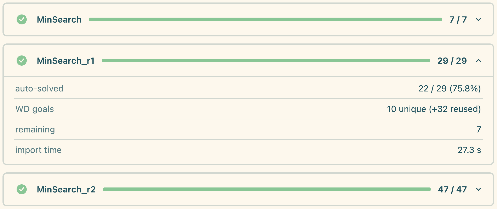

# BARReL: **B** **A**utomated t**R**anslation for **Re**asoning in **L**ean 

BARReL bridges Atelier B proof obligations to Lean. It parses `.pog` files (the [PO XML format](https://www.atelierb.eu/wp-content/uploads/2023/10/pog-1.0.html) produced by Atelier B), converts the obligations into Lean terms, and lets you discharge them with Lean tactics.

## Prerequisites
- Lean 4 (see [`lean-toolchain`](lean-toolchain) for version).
- Mathlib (pulled automatically by Lake).
- For `import machine`: an Atelier B installation with `bin/bxml` and `bin/pog` available. 
  Point BARReL to it with `set_option barrel.atelierb "<path-to-atelierb-root>"` (the directory that contains `bin/` and `include/`).

## Quick start
### Setting up the environment
```bash
lake update     # fetch mathlib and dependencies
lake build      # build all libraries
```

To experiment with the sample machines, open `Test.lean` in your editor or run:
```bash
lake lean Test.lean
```
Note that you may have to edit the path to the Atelier B distribution in `Test.lean` at the beginning of the file.

### Quick example
Consider the B machine [`CounterMin.mch`](specs/CounterMin.mch):
```
MACHINE CounterMin
VARIABLES X
INVARIANT
  X ∈ FIN1(ℤ) ∧ max(X) = -min(X)
INITIALISATION
  X := {0}
OPERATIONS
  inc =
  ANY z WHERE z ∈ ℕ THEN
    X := (-z)..z
  END
END
```
The obligations for this machine include invariant initialisation and preservation for `inc`, together with well-formedness conditions:
- _Initialisation_:
  - `{0} ∈ FIN₁(INTEGER)`
  - `max({0}) = -min({0})`
- _Invariant preservation_ for `inc`:
  - `∀ z ∈ ℤ, ∀ X ∈ FIN₁(ℤ), max(X) = -min(X) → z ∈ ℕ → (-z)..z ∈ FIN₁(ℤ)`
  - `∀ z ∈ ℤ, ∀ X ∈ FIN₁(ℤ), max(X) = -min(X) → z ∈ ℕ → max((-z)..z) = -min((-z)..z)`
- _Well-formedness conditions_.

In Lean, `import machine` runs the auto-discharger (`barrel_solve`) over the generated obligations. The exact number of subgoals and which ones remain depend on the POG and available automation. When the two equalities remain, they can be proved as follows:

```lean
import Barrel

set_option barrel.atelierb "/<path-to-atelierb-root>/atelierb-free-arm64-24.04.2.app/Contents/Resources"

open B.Builtins

import machine CounterMin from "specs/"

next obligation of CounterMin by
  intros _ _
  rw [max.of_singleton, min.of_singleton]
  rfl

next obligation of CounterMin by
  rintro X z - - hz
  rw [interval.min_eq (neg_le_self hz),
      interval.max_eq (neg_le_self hz),
      Int.neg_neg]

qed CounterMin
```

If auto-discharge solves every goal, the import needs only `qed CounterMin`; omit the two proof commands. Each remaining obligation has its own command. Lean can reuse completed command snapshots when a later proof is edited, rather than replaying a single block containing every proof. This gives command-level incremental processing; it does not promise that tactic scripts run in parallel. The live progress card in the infoview shows how many goals were solved automatically and how many are left.

> [!NOTE]
> By default, option `barrel.show_goal_names` is set to `true`, which will display the name of each proof obligation at each obligation command, but it can be disabled with:
> ```lean
> set_option barrel.show_goal_names false
> ```

## Live progress in the editor
Industrial POGs can take minutes to import, so each `import` reports into a self-updating **progress card** in the infoview, grouped under a foldable **BARReL state** pane (one card per machine)

<p align="center">
  
  <br/><em>While importing: a spinner and a blue bar that fills as Atelier B's obligations stream in; green bar indicates auto-solved goals.</em>
</p>

<p align="center">
  
  <br/><em>While discharging: yellow (contains <code>sorry</code>), red badge (missing goals).</em>
</p>

<p align="center">
  
  <br/><em>After discharging: green (all proved), with one card unfolded.</em>
</p>

Click a card to expand its summary table: auto-solved count and percentage, unique well-definedness (WD) goals and avoided duplicate allocations, and how many obligations remain. Cells with a proof command jump to its source location when clicked. The **proof skeleton** button appends one named `obligation ... of ... by` command per pending goal and a final `qed`. Its `sorry` placeholders must be replaced to obtain complete proofs.

Progress follows each import's local context, including proofs not yet published by `qed`. Removing or changing a proof command restores the corresponding cell from the current command snapshot.

The panel is on by default; three options control the reporting:

- `barrel.progress` (default `true`) — the live card. Set to `false` to suppress the panel and its reporting entirely.
- `barrel.summary` (default `false`) — also log the summary table as a text message after each import, for batch builds and CI logs.
- `barrel.show_auto_solved` (default `false`) — print the `🎉 Automatically solved N out of M subgoals!` message.

## Using the discharger

The workflow has three steps: import obligations into a private context, prove them with separate commands, and publish their theorems with `qed`.

- `import` calls Atelier B (`bxml` then `pog`) for a machine, refinement, implementation, or system. `import pog` reads an existing `.pog` directly. The directory defaults to `.`. Auto-discharge runs during import, but generated declarations stay in that import's private context.
- `next obligation` selects the next unproved goal, with remaining well-definedness goals before main goals. `obligation <goal-name>` selects a particular goal by its generated name, so proofs can appear in a different order. Names are relative to the selected import: use `obligation Initialisation_1 of Counter`, without repeating `Counter` in the goal name. Nested names such as `Minimum_0.wd_0` select well-definedness obligations within that import. `next obligation <goal-name>` is an error: use either selection method.
- `by` elaborates a tactic script. `from <term>` elaborates the term against the goal, equivalently to `by exact <term>`. A successful command stores its proof locally; later obligations for the same import can use it by name.
- `of <name>` selects an import explicitly. When omitted, the command selects the most recently imported component. `qed` uses the same default; explicitly proving or finalizing another component does not change it.
- `qed <name>` checks that no obligations remain pending, then publishes the local declarations to Lean's global environment. If goals remain, it reports their names and publishes nothing. Encoding failures also prevent finalization.

For example, imports and their proof commands can be interleaved:

```lean
import pog Counter from "specs/"
import pog Nat from "specs/"

next obligation of Counter by
  -- tactics for Counter's next pending goal
  ...

next obligation by
  -- tactics for Nat, the latest import
  ...

-- After every Counter obligation has a proof:
qed Counter

-- Nat remains the default target.
obligation Initialisation_1 from someProof
-- After every Nat obligation has a proof:
qed
```

The example illustrates command selection; goal names and proofs depend on the imported POG. The progress card's skeleton supplies the actual names. BARReL names generated theorems using the current namespace, component name, POG tag, and index; for example, `Counter.Initialisation_1` (see [`Discharger.lean`](Barrel/Discharger.lean)). Before `qed`, these names are available only in obligation proofs for their own import. After `qed`, ordinary Lean commands and other imports' proof scripts can use them.

As in ordinary Lean declarations, an explicit `sorry` is accepted with a warning and shown in yellow. `qed` checks that every obligation has an elaborated proof; it does not certify the absence of `sorry`. Use `assert_no_sorry Counter.Initialisation_1` (with the relevant declaration name) to check published declarations for sorry dependencies. A failed tactic is an error and leaves its obligation pending.

## How it works (high level)
1. **Parse PO XML**: read types, definitions, and proof obligations from Atelier B’s PO XML schema.
2. **Extract logical goals**: turn the schema into `Goal` records containing variables, hypotheses, and the goal term.
3. **Encode to Lean**: map B terms and types to Lean expressions, using the set-theoretic primitives in `Barrel/Builtins.lean` and Lean's meta-programming features.
4. **Discharge**: encode each import in its own environment and store proofs from auto-discharge or individual obligation commands there. Generated goals should closely resemble the original B proof obligations.
5. **Publish**: `qed` checks completeness and adds the import's declarations to the current global environment, preserving declarations published by other interleaved imports.

Each import stores a base and a working `Lean.Environment` in an environment extension restored with Lean's command snapshots. An obligation command reuses the checked working environment when only BARReL bookkeeping has changed. A conservative identity check compares every other environment field and extension state, so intervening declarations or attribute changes trigger the existing full rebase. `qed` always performs the full merge onto the current global environment. The merge rejects name collisions, checks replayed declarations against the kernel environment, and copies helper metadata such as matcher information needed by `split` and simplification. Tactic elaboration remains synchronous. Lean already reuses whole unchanged commands in an unchanged prefix, including their resulting environment; after an earlier command changes, subsequent commands are elaborated again. Goal selection and dependency membership use cached name indices; a pending cursor and maintained proof counters avoid rescanning the full obligation list for each command. These caches live in the same command snapshots as the proofs, so edits and failed commands restore them together.

The encoder shares WD proof metavariables throughout an import. At each partial operator, it closes the WD condition over the current variables and hypotheses and looks it up before allocating a metavariable. Matching conditions reuse the same proof metavariable even while it remains unproved. Conditions that become equal only after type inference finishes are merged inside the encoder. Failed encodings restore both the Lean state and the WD cache; successful encodings export named obligations for the discharger.

## Sample models
The `specs/` folder contains small machines used during development:
- `Counter.mch`, `Nat.mch`, `Forall.mch`, `Exists.mch`, `Injective.mch`, `HO.mch`, `Enum.mch`, `Lambda.mch`, and their corresponding `.pog` files.
You can copy these as templates when adding new B models.


## Contributing
Contributions and bug reports are very welcome!
